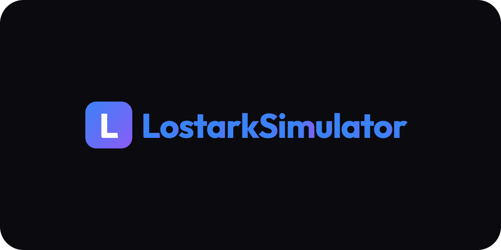

<p align="center">
  
</p>

<p align="center">
  
</p>

# Lost Ark Simulator Engine

A high-performance, event-driven combat simulation engine for [Lost Ark Simulator](https://lostarksim.com/).

## Overview

- **Input:** Prepared JSON build and simulation settings
- **Output:** Aggregate results or a single-run trace
- **Runtime:** Rust compiled to WebAssembly

The web application and full game data are maintained separately. Files in `tests/fixtures/` are small examples used by the engine tests.

## Test

```sh
cargo check --locked
cargo test --locked
```

The current snapshot has 5 known failing trace assertions (174 of 179 tests pass).

## License

Copyright (C) 2026 Minjea Kim.

This project is licensed under the GNU General Public License v3.0 only (`GPL-3.0-only`). See [LICENSE](LICENSE).

Lost Ark is a trademark of Smilegate RPG; this project is not affiliated with Smilegate RPG.
